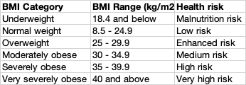

BMI Calculator 
=============

This is just a demo project to calculate the BMI (Body Mass Index) of the person. This can help identify the high risk people given their weight and height is known.
* Problem statement 1- Calculate the BMI using the given Table 1 and add three new columns
  * BMI 
  * BMI Category 
  * Health Risk
* Problem statement 2- Count the total number of overweight covering the corner cases


**Table 1**



###  Setup
Download the git repo
```
git clone  https://github.com/chandanparihar1986/code-20220606-chandanparihar.git
```


###  How to Build
```
cd <local_git_repo_path>
python3 -m main.py
```

###  Run the test
```
cd <local_git_repo_path>
python -m unittest tests/test_bmicalculator.py 
```

###  Out of scope
Parameterization using confile file 
   * All hardcoded values must be passed through the config file i.e. source, target, file path, etc.

CICD - stage or prod deployment

END to End pipeline   (Ingestion, Integration, Processing, Storage & Visualization)


###  Considerations
Assuming there would be high volume of data to be processed where the data comes in from the source system at 1 MM/sec rate, we can build the solution
using two approaches
* Extend this solution and build a PySpark application using the same classes as used here
* Extend this solution and build a multithreaded application using the same classes as used here
     * please keep in mind there will be limitations of this solution. We will get the concurrency 
          however the application is limited to the number of CPUs available per machine.
     * I would lean towards using the first approach above when dealing with high volume of data with a requirement of low latency.
          Basically, building the big data ETL pipelines and running them on big data plateforms.


